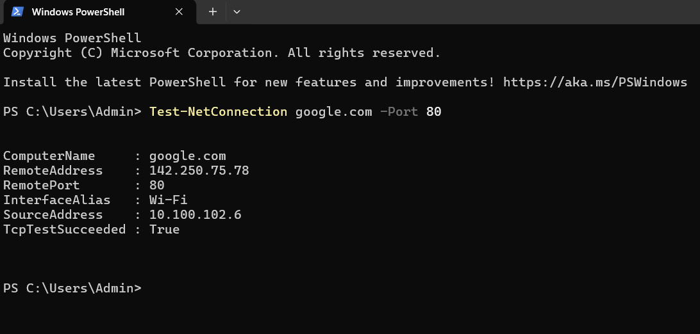
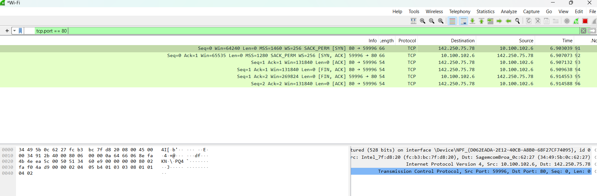

# TryHackMe – Networking Concepts

This folder contains my personal documentation and learning summary from the  
**Networking Concepts** room on TryHackMe.

This room introduces the **fundamental building blocks of computer networking**, focusing on how data is transmitted across networks, how protocols are layered, and how real network communication works in practice.

---

## 🧠 What I Learned

- The purpose and structure of the **OSI model** and its 7 layers
- How real-world networking maps OSI into the **TCP/IP model**
- The role of each OSI layer in network communication
- Differences between **TCP and UDP**
- How **ports** identify services on a host
- How **IP addresses** are structured and used
- The difference between **public and private IP addresses**
- How **routing** works between networks
- How **DNS** resolves domain names to IP addresses
- How **MAC addresses** work at the data link layer
- How real packets look inside **Wireshark**
- Understanding **encapsulation** and how data is wrapped layer by layer
- Using **telnet** to manually interact with network services
- Communicating with:
  - Echo server (port 7)
  - Daytime server (port 13)
  - HTTP server (port 80)
- Understanding application-layer protocols such as:
  - HTTP, FTP
  - SMTP, POP3, IMAP
- Understanding **MIME** and how data encoding works

---

## 🧩 OSI Model Overview

| Layer | Name | Main Responsibility |
|-----|------|--------------------|
| 7 | Application | User-facing network services |
| 6 | Presentation | Encoding, compression, encryption |
| 5 | Session | Session management and synchronization |
| 4 | Transport | End-to-end communication (TCP/UDP) |
| 3 | Network | IP addressing and routing |
| 2 | Data Link | MAC addressing and frames |
| 1 | Physical | Signals, cables, and wireless transmission |

Although the OSI model defines 7 layers, real-world networking commonly follows the TCP/IP model. In this model, the OSI Presentation and Session layers are merged into the Application layer, resulting in a simplified 5 layer architecture.

---

## 🛠️ Practical Hands-On Topics

### 🔌 Network Interfaces & IP Configuration
- Viewing IP configuration using:
  - `ipconfig` (Windows)
  - `ifconfig`, `ip a` (Linux)
- Understanding CIDR notation (`/24`)
- Identifying network and broadcast addresses

---

### 🌐 IP Addressing
- IPv4 structure (32-bit, four octets)
- Private IP ranges:
  - `10.0.0.0/8`
  - `172.16.0.0/12`
  - `192.168.0.0/16`
- Why private IPs require **NAT** to access the Internet

---

### 📡 Data Link & MAC Addresses
- MAC address structure (6 bytes)
- Vendor identification via OUI (Identifies the vendor of a network interface and consists of the first three bytes of a MAC address)
- Source and destination MAC addresses in each frame
- Viewing Ethernet/Wi-Fi frames in Wireshark

---

### 🚦 Transport Layer
- TCP vs UDP:
  - TCP: reliable, connection-oriented, three-way handshake
  - UDP: fast, connectionless, no delivery guarantee
- Port numbers and service identification
- Common ports:
  - HTTP (80)
  - HTTPS (443)
  - FTP (21)
  - SMTP (25)
  - POP3 (110)
  - IMAP (143)

---

### 🧪 Telnet Experiments
- Using telnet as a raw TCP client
- Echo server (port 7)
- Daytime server (port 13)
- HTTP server (port 80)
- Manually sending HTTP requests:
  ```text
  GET / HTTP/1.1
  Host: telnet.thm

---

### 📦 Encapsulation

- Application data

- TCP/UDP segment

- IP packet

- Ethernet/Wi-Fi frame

- Understanding how data is wrapped and unwrapped at each layer

---

## 📂 Repository Structure

- summary.md – Detailed theoretical explanations and networking concepts

- screenshots/ – Terminal output, Wireshark captures, and hands-on demonstrations

---

## 🎯 Purpose

This documentation demonstrates a strong foundation in networking concepts, which are essential for:

- SOC operations

- Blue Team monitoring

- Network traffic analysis

- Firewall and IDS understanding

- Incident response

- Understanding how attacks move across the network

---

## screenshots
### TCP Connectivity Test (Port 80)

First, a TCP connection test was performed using PowerShell to verify
connectivity to google.com on port 80.



The connection was then analyzed at the packet level using Wireshark,
showing the full TCP three-way handshake (SYN, SYN-ACK, ACK) and connection
termination.




